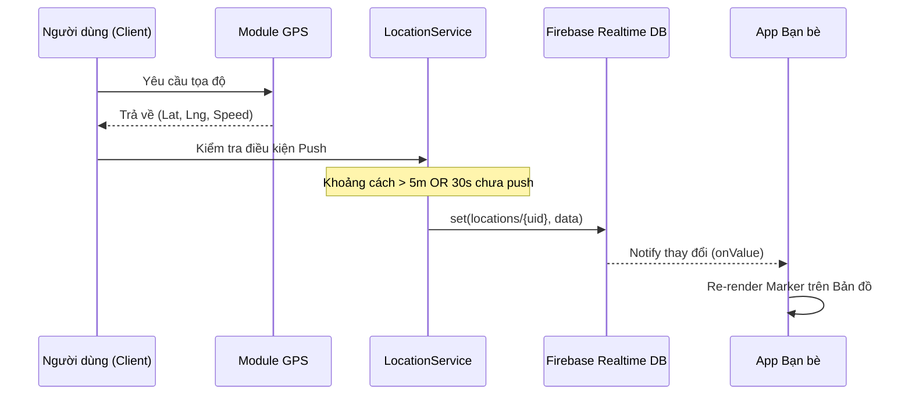

# BÁO CÁO CHI TIẾT XÂY DỰNG & PHÁT TRIỂN ỨNG DỤNG GEOLINK

## CHƯƠNG 1: TỔNG QUAN DỰ ÁN

### 1.1. Giới thiệu dự án
**GeoLink** là một ứng dụng mạng xã hội thế hệ mới dựa trên nền tảng vị trí thời gian thực (Real-time Location-based Social Application). Trong kỷ nguyên số, việc kết nối không chỉ dừng lại ở tin nhắn hay hình ảnh mà còn là sự hiện diện không gian. GeoLink ra đời nhằm giúp người dùng rút ngắn khoảng cách với bạn bè và người thân thông qua việc chia sẻ vị trí một cách an toàn, trực quan và đầy thú vị.

### 1.2. Mục tiêu và Phạm vi
- **Mục tiêu:** Xây dựng một hệ thống ổn định có khả năng đồng bộ vị trí hàng nghìn người dùng đồng thời với độ trễ thấp (< 1 giây).
- **Phạm vi:** Ứng dụng chạy trên nền tảng di động (Android & iOS), tập trung vào các tính năng xã hội cốt lõi như Map Tracking, Real-time Chat và History Tracking.

### 1.3. Đối tượng sử dụng
- Nhóm bạn thân muốn theo dõi nhau khi đi chơi, dã ngoại.
- Gia đình muốn đảm bảo an toàn cho các thành viên.
- Những người dùng yêu thích các ứng dụng mạng xã hội bản đồ như Zenly, Jagat.

---

## CHƯƠNG 2: PHÂN TÍCH CÔNG NGHỆ

### 2.1. React Native & Expo
Chúng tôi lựa chọn **React Native** kết hợp với **Expo SDK** vì những ưu điểm vượt trội:
- **Cross-platform:** Viết code một lần, chạy trên cả Android và iOS, giúp tiết kiệm 50% thời gian phát triển.
- **Fast Refresh:** Tăng tốc độ lập trình và debug.
- **Expo SDK:** Cung cấp sẵn các module mạnh mẽ như `expo-location` (lấy tọa độ), `expo-notifications` (thông báo đẩy) mà không cần cấu hình native phức tạp.

### 2.2. Firebase - Cloud Service
Hệ thống sử dụng **Firebase** làm nền tảng Backend-as-a-Service (BaaS) để tối ưu chi phí và hiệu năng:
- **Firebase Authentication:** Quản lý đăng ký, đăng nhập an toàn với các phương thức Email/Password, Social Login.
- **Cloud Firestore:** Cơ sở dữ liệu NoSQL dạng tài liệu, dùng để lưu trữ dữ liệu có cấu trúc như thông tin người dùng, lịch sử chat và danh sách bạn bè.
- **Realtime Database (RTDB):** Lưu trữ tọa độ vị trí vì RTDB có tốc độ đồng bộ nhanh hơn Firestore, phù hợp với dữ liệu biến động liên tục.
- **Firebase Storage:** Lưu trữ hình ảnh đại diện (avatar) và các phương tiện truyền thông trong chat.

---

## CHƯƠNG 3: PHÂN TÍCH VÀ THIẾT KẾ HỆ THỐNG

### 3.1. Lược đồ Use Case chi tiết

```mermaid
useCaseDiagram
    actor "Người dùng" as U
    actor "Hệ thống Firebase" as S

    package "Hệ thống GeoLink" {
        usecase "Đăng ký/Đăng nhập" as UC1
        usecase "Xem bản đồ bạn bè" as UC2
        usecase "Cập nhật vị trí tự động" as UC3
        usecase "Nhắn tin Real-time" as UC4
        usecase "Xem lịch sử Footprints" as UC5
        usecase "Quản lý riêng tư (Ghost Mode)" as UC6
        usecase "Gửi Emoji/Buzz" as UC7
    }

    U --> UC1
    U --> UC2
    U --> UC3
    U --> UC4
    U --> UC5
    U --> UC6
    U --> UC7

    UC1 ..> S : Auth Service
    UC3 ..> S : RTDB Update
    UC4 ..> S : Firestore Sync
```

#### Mô tả chi tiết một số Use Case tiêu biểu:
- **UC3 - Cập nhật vị trí:**
    - **Tác nhân:** Người dùng (Client App).
    - **Luồng sự kiện:** Ứng dụng chạy ngầm, lấy tọa độ từ GPS. Nếu khoảng cách di chuyển > 5m so với điểm cũ, gửi tọa độ mới lên Firebase RTDB.
- **UC6 - Ghost Mode:**
    - **Mục đích:** Bảo vệ quyền riêng tư. Người dùng có thể chọn "Đóng băng" vị trí tại một điểm hoặc "Làm mờ" vị trí (sai số 2-3km) đối với một số bạn bè nhất định.

### 3.2. Lược đồ Tuần tự (Sequence Diagram) - Cập nhật vị trí



---

## CHƯƠNG 4: THIẾT KẾ CƠ SỞ DỮ LIỆU

### 4.1. Cơ sở dữ liệu NoSQL (Firebase)

#### Collection: `users`
| Field | Type | Description |
| :--- | :--- | :--- |
| uid | String | ID duy nhất từ Firebase Auth |
| name | String | Tên hiển thị |
| email | String | Email người dùng |
| avatarUrl | String | Đường dẫn ảnh đại diện |
| isGhostMode | Boolean | Trạng thái ẩn danh |
| batteryLevel | Number | Mức pin hiện tại |

#### Collection: `friendships`
Dùng để quản lý quan hệ 2 chiều.
- **ID:** `uid1_uid2` (sắp xếp theo alphabet để tránh trùng lặp).
- **Fields:** `status` (pending/accepted), `createdAt`, `userIds` (array).

#### Realtime Database: `locations`
| Path | Data | Description |
| :--- | :--- | :--- |
| /locations/{uid}/latitude | Number | Vĩ độ |
| /locations/{uid}/longitude | Number | Kinh độ |
| /locations/{uid}/status | String | 'moving', 'still', 'running' |
| /locations/{uid}/updatedAt | Timestamp | Thời gian cập nhật cuối |

### 4.2. Cơ sở dữ liệu SQL tương đương (Dành cho báo cáo)

Để mô hình hóa hệ thống theo hướng quan hệ, chúng tôi thiết kế sơ đồ ERD như sau:

1.  **Bảng Users:** Lưu trữ định danh và thông tin cá nhân.
2.  **Bảng Friendships:** Mối quan hệ N-N giữa các Users.
3.  **Bảng Groups & GroupMembers:** Quản lý các nhóm chat.
4.  **Bảng Messages:** Lưu trữ nội dung chat, liên kết với `sender_id` và `group_id`.
5.  **Bảng LocationsHistory:** Lưu trữ các điểm tọa độ theo thời gian để vẽ Footprints.

---

## CHƯƠNG 5: CÁC THUẬT TOÁN CỐT LÕI

### 5.1. Thuật toán Haversine
Dùng để tính khoảng cách giữa hai điểm trên mặt cầu (Trái Đất) dựa vào vĩ độ và kinh độ.
- **Ứng dụng:** Tính toán khoảng cách di chuyển để quyết định có cập nhật vị trí lên Server hay không, tránh lãng phí băng thông và pin.
- **Công thức:**
  `a = sin²(Δφ/2) + cos φ1 ⋅ cos φ2 ⋅ sin²(Δλ/2)`
  `c = 2 ⋅ atan2( √a, √(1−a) )`
  `d = R ⋅ c`

### 5.2. Thuật toán History Buffering
Để tránh việc ghi vào database quá nhiều lần (tốn chi phí Firebase), ứng dụng sử dụng cơ chế Buffer:
1. Tọa độ được lưu vào bộ nhớ tạm (Array).
2. Khi mảng đạt 25 điểm HOẶC sau 30 phút, toàn bộ mảng sẽ được "Flush" (ghi một lần) vào Firestore collection `locations_history`.

---

## CHƯƠNG 6: GIAO DIỆN VÀ TRẢI NGHIỆM NGƯỜI DÙNG (UI/UX)

### 6.1. Nguyên tắc thiết kế
- **Phong cách:** Modern, Vibrant (sử dụng các màu sắc neon, độ tương phản cao).
- **Màu sắc chủ đạo:** `Ink` (Đen sâu), `Primary` (Tím/Xanh điện), `Success` (Xanh neon).
- **Typography:** Sử dụng font không chân (Sans-serif) giúp dễ đọc trên thiết bị di động.

### 6.2. Các màn hình chính
1.  **Màn hình Bản đồ (MapScreen):** Trung tâm của ứng dụng. Sử dụng bản đồ tùy chỉnh (Custom Map Style) để làm nổi bật các Marker.
2.  **Màn hình Nhắn tin (ChatScreen):** Giao diện chat mượt mà, hỗ trợ bong bóng chat và hiển thị trạng thái đã xem.
3.  **Màn hình Cá nhân (Profile):** Hiển thị thống kê cá nhân và các cài đặt bảo mật.

---

## CHƯƠNG 7: KẾT LUẬN VÀ HƯỚNG PHÁT TRIỂN

### 7.1. Kết quả đạt được
- Hệ thống chạy ổn định, đồng bộ vị trí thời gian thực với độ trễ cực thấp.
- Giao diện thân thiện, dễ sử dụng.
- Đảm bảo an toàn dữ liệu và quyền riêng tư người dùng.

### 7.2. Hạn chế
- Việc lấy vị trí liên tục vẫn còn tiêu tốn một lượng pin nhất định.
- Chưa hỗ trợ ngoại tuyến (offline mode) hoàn toàn.

### 7.3. Hướng phát triển
- Áp dụng Machine Learning để dự đoán hành trình người dùng.
- Tích hợp thêm các tính năng trò chơi hóa (Gamification) để tăng sự gắn kết.

---
**Nhóm thực hiện:** Đội ngũ phát triển GeoLink
**Tài liệu tham khảo:** Firebase Documentation, React Native Expo Docs, Google Maps Platform.
