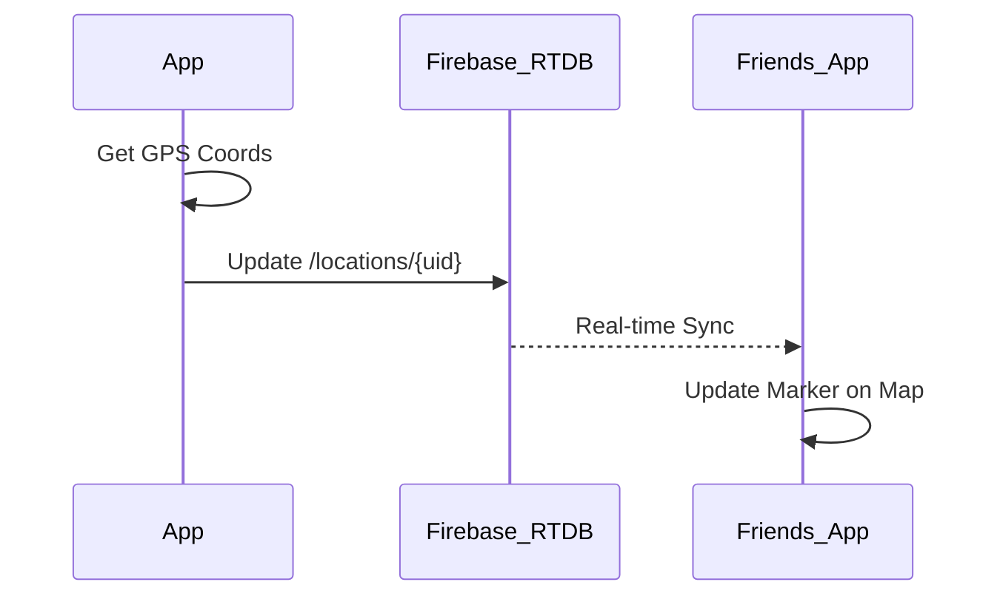

# 📍 GeoLink - Real-time Location Social Network

[](https://expo.dev/)
[](https://reactnative.dev/)
[](https://firebase.google.com/)

**GeoLink** là ứng dụng mạng xã hội chia sẻ vị trí thời gian thực, giúp bạn luôn kết nối với bạn bè và người thân một cách trực quan và bảo mật.

---

## ✨ Tính năng nổi bật

- 📍 **Bản đồ thời gian thực**: Theo dõi vị trí bạn bè chính xác từng giây.
- 👣 **Footprints**: Xem lại lịch sử di chuyển trong ngày với các đường vẽ Polyline mượt mà.
- 💬 **Chat Real-time**: Nhắn tin cá nhân và nhóm tích hợp ngay trong bản đồ.
- ⚡ **Tương tác tức thì**: Gửi Emoji, Buzz (rung máy) trực tiếp đến Marker của bạn bè.
- 👻 **Chế độ ẩn danh (Ghost Mode)**: Tùy chỉnh quyền riêng tư, ẩn vị trí hoặc đóng băng vị trí.
- 🔋 **Thông tin thiết bị**: Xem mức pin và trạng thái di chuyển (đang đi bộ, đang chạy, đứng yên).

---

## 🛠 Công nghệ sử dụng

- **Frontend**: React Native (Expo SDK), Lucide Icons, React Navigation.
- **Backend-as-a-Service**: 
  - **Firebase Auth**: Quản lý người dùng.
  - **Cloud Firestore**: Lưu trữ dữ liệu cấu trúc, tin nhắn, lịch sử.
  - **Realtime Database**: Đồng bộ vị trí và tương tác cực nhanh.
- **Maps**: Google Maps API / Apple Maps qua `react-native-maps`.

---

## 📊 Kiến trúc hệ thống

### Use Case Diagram
```mermaid
useCaseDiagram
    actor User
    User --> (View Map & Friends)
    User --> (Share Real-time Location)
    User --> (Chat with Friends)
    User --> (View Travel History)
    User --> (Ghost Mode Toggle)
```

### Sequence Diagram (Location Sync)


---

## 📂 Cấu trúc thư mục

```text
src/
├── core/           # Cấu hình, Hooks (useLocation), Utils
├── domain/         # Định nghĩa kiểu dữ liệu (Entities)
├── infrastructure/ # Services (Auth, Location, Chat với Firebase)
└── presentation/   # Giao diện (Screens, Components, Theme, Navigation)
```

---

## 🚀 Cài đặt & Khởi chạy

1. **Clone project**:
   ```bash
   git clone <url-repo>
   ```
2. **Cài đặt thư viện**:
   ```bash
   npm install
   ```
3. **Cấu hình Firebase**:
   Tạo file `.env` và thêm các biến môi trường từ Firebase Console:
   ```env
   EXPO_PUBLIC_FIREBASE_API_KEY=xxx
   EXPO_PUBLIC_FIREBASE_AUTH_DOMAIN=xxx
   ...
   ```
4. **Chạy ứng dụng**:
   ```bash
   npx expo start
   ```

---

## 📄 Tài liệu chi tiết
Xem chi tiết báo cáo và hướng dẫn phát triển tại: [PROJECT_DOCUMENTATION.md](./PROJECT_DOCUMENTATION.md)

---
Developed by **GeoLink Team** with ❤️
